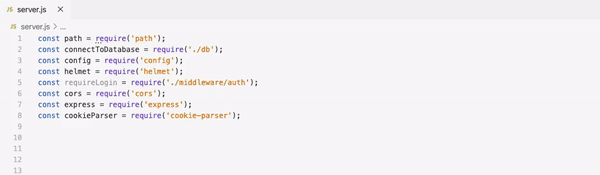

[Click here to Install the Extension](https://marketplace.visualstudio.com/items?itemName=Ashwin.ascending-code)

# ascending-code README

Code in random order is extremely annoying for everyone. Some parts of your code can and should be arranged to make it look neater. This plugin aims to remove all that manual work by automatically arranging any code snippet you choose in Ascending order.

## Features

## Requirements

None

## Extension Settings

This extension contributes the following settings:

* `ascending-code.enable`: enable/disable this extension
* `ascending-code.arrangeCode`: Arrange selection of code in arranging order.

## Known Issues

No known issues.

## Release Notes

### 1.0.0

Initial release of Ascending Code
